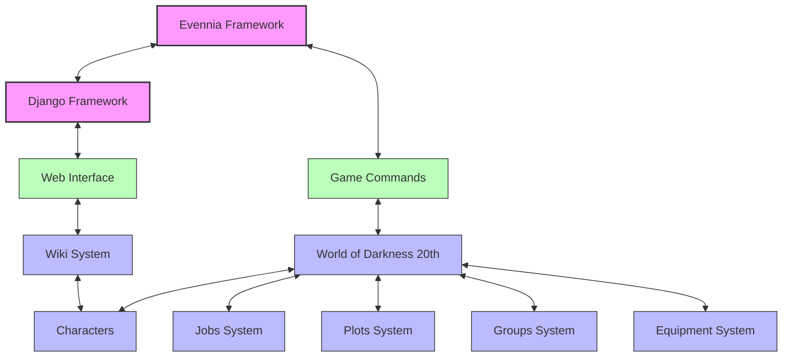
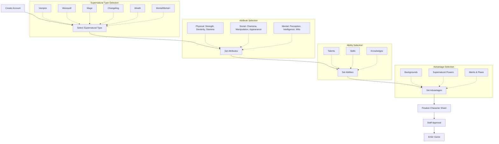
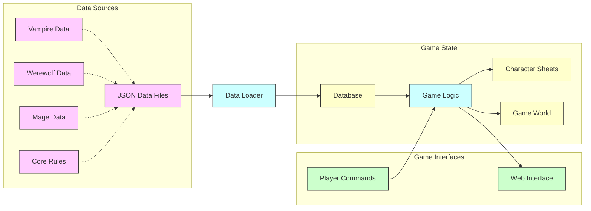
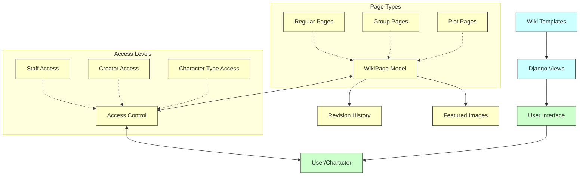
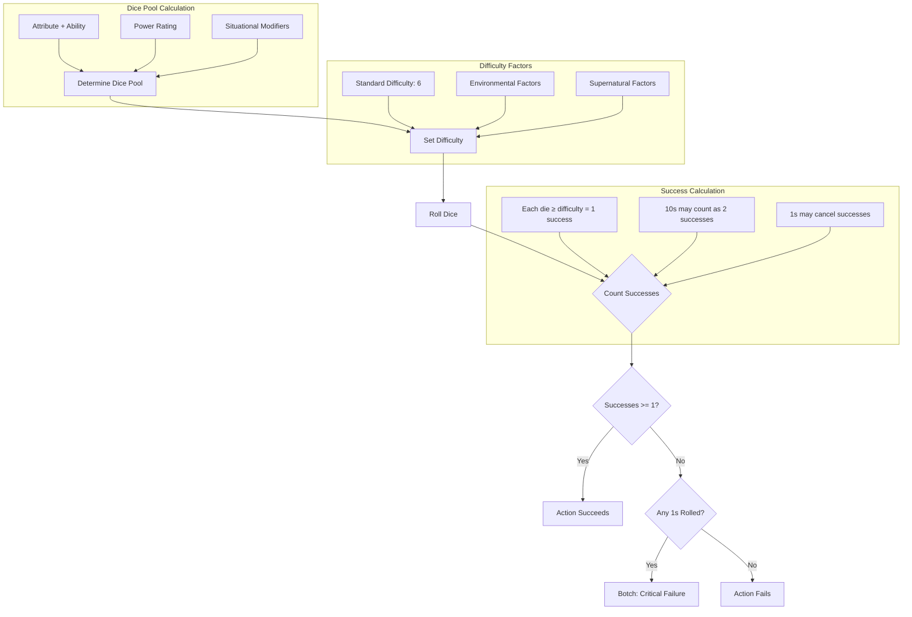

# Dies Irae Game Wiki

Welcome to the comprehensive documentation for the Dies Irae game, a World of Darkness MUSH set in San Diego. This wiki provides detailed information about the game's systems, mechanics, and codebase structure.


## Table of Contents

- [Introduction](#introduction)
- [Game Architecture](#game-architecture)
  - [Repository Structure](#repository-structure)
  - [System Overview](#system-overview)
- [Game Systems](#game-systems)
  - [Character System](#character-system)
  - [World of Darkness 20th Anniversary System](#world-of-darkness-20th-anniversary-system)
  - [Supernatural Types](#supernatural-types)
    - [Vampire: The Masquerade](#vampire-the-masquerade)
    - [Werewolf: The Apocalypse](#werewolf-the-apocalypse)
    - [Mage: The Ascension](#mage-the-ascension)
    - [Changeling: The Dreaming](#changeling-the-dreaming)
    - [Wraith: The Oblivion](#wraith-the-oblivion)
    - [Other Changing Breeds](#other-changing-breeds)
    - [Mortal and Mortal+](#mortal-and-mortal)
  - [Wiki System](#wiki-system)
  - [Jobs System](#jobs-system)
  - [Plots System](#plots-system)
  - [Groups System](#groups-system)
  - [Equipment System](#equipment-system)
- [Technical Documentation](#technical-documentation)
  - [Installation Guide](#installation-guide)
  - [Development Guide](#development-guide)
  - [Data Loading](#data-loading)
  - [Command Reference](#command-reference)
- [Flowcharts and Diagrams](#flowcharts-and-diagrams)
  - [Game Architecture Diagram](#game-architecture-diagram)
  - [Character Creation Flowchart](#character-creation-flowchart)
  - [Data Flow Diagram](#data-flow-diagram)
  - [Wiki System Diagram](#wiki-system-diagram)
  - [Supernatural Type Relationships](#supernatural-type-relationships)

## Introduction

Dies Irae is a World of Darkness MUSH (Multi-User Shared Hallucination) set in the city of San Diego. It is built on the Evennia framework, a Python-based MUD/MUSH server, with extensive customizations to support the World of Darkness 20th Anniversary Edition ruleset.

The game supports multiple supernatural types from the World of Darkness setting, including:
- **Vampire: The Masquerade** - Undead creatures who feed on blood and navigate complex political structures
- **Werewolf: The Apocalypse** - Shapeshifters who battle against corruption and defend the natural world
- **Mage: The Ascension** - Reality-benders who shape the world through their paradigms and beliefs
- **Changeling: The Dreaming** - Fae souls in human bodies who balance between mundane reality and dreams
- **Wraith: The Oblivion** - Spirits of the dead navigating the underworld
- **Mortal and Mortal+** - Humans with or without supernatural abilities

## Game Architecture

### Repository Structure

The Dies Irae codebase is organized into several key directories:

```
game/
├── commands/         # Game commands for player interaction
│   ├── bbs/          # Bulletin board system commands
│   ├── documentation/# Help and documentation commands
│   ├── jobs/         # Staff jobs system commands
│   └── oss/          # One-shot scene commands
├── data/             # Game data files (JSON format)
├── Scripts/          # Utility scripts including auto-updater
├── server/           # Evennia server configuration
│   ├── conf/         # Server configuration files
│   └── logs/         # Server log files
├── typeclasses/      # Core game object definitions
├── utils/            # Utility functions
├── web/              # Web interface components
│   ├── admin/        # Django admin customizations
│   ├── api/          # API endpoints
│   ├── character/    # Character web interface
│   ├── static/       # Static files (CSS, JS, images)
│   ├── templates/    # HTML templates
│   ├── templatetags/ # Custom template tags
│   ├── webclient/    # Web-based game client
│   └── website/      # Main website components
├── wiki/             # Wiki system for documentation
│   ├── migrations/   # Database migrations
│   ├── static/       # Wiki-specific static files
│   ├── templates/    # Wiki templates
│   └── templatetags/ # Wiki template tags
└── world/            # Game world mechanics and systems
    ├── combat/       # Combat system
    ├── equipment/    # Equipment system
    ├── groups/       # Groups and organizations
    ├── hangouts/     # Hangout locations system
    ├── jobs/         # Staff jobs system
    ├── management/   # Django management commands
    ├── plots/        # Story plots system
    ├── requests/     # Character request system
    ├── tests/        # Test suite
    └── wod20th/      # World of Darkness ruleset implementation
        ├── management/  # WoD-specific management commands
        ├── migrations/  # Database migrations
        ├── scripts/     # Game scripts
        ├── templates/   # WoD-specific templates
        ├── tests/       # Test suite
        └── utils/       # WoD utility functions
```

### System Overview

Dies Irae is built on several interconnected systems:

1. **Evennia Core**: Provides the base MUD/MUSH server functionality
   - Command handling and processing
   - Object persistence and database management
   - Server-client communication
   - Script scheduling

2. **Django Framework**: Powers the web interface and database models
   - ORM for database interactions
   - Admin interface for staff management
   - Web views and templates
   - User authentication and permissions

3. **World of Darkness 20th**: Custom implementation of WoD 20th Anniversary Edition rules
   - Character sheet mechanics
   - Supernatural powers and abilities
   - Game-specific rules and systems

4. **Custom Systems**: Additional systems for plots, jobs, groups, etc.
   - Staff management tools
   - Player organization tools
   - Storytelling aids
   - Community features

## Game Systems

### Character System

The character system is the foundation of player interaction in Dies Irae. Characters are represented by the `Character` typeclass, which extends Evennia's base character class with World of Darkness specific functionality.

Key features:
- **Character Sheets**: Comprehensive tracking of attributes, abilities, and powers
- **Supernatural Types**: Support for various World of Darkness character types
- **Experience System**: Point-based advancement with staff approval
- **Character Development**: Tracking of character history, relationships, and growth
- **Portraits and Descriptions**: Visual and textual representation of characters

Character stats are stored in a nested dictionary structure:
```python
character.db.stats = {
    "category": {        # e.g., "Attribute", "Ability", "Power"
        "stat_type": {   # e.g., "Physical", "Social", "Mental"
            "stat_name": {  # e.g., "Strength", "Charisma", "Intelligence"
                "perm": value,  # Permanent value
                "temp": value   # Temporary value (may be modified)
            }
        }
    }
}
```

The character system provides methods for interacting with this structure:
- `get_stat(category, stat_type, stat_name)`: Retrieve a stat value
- `set_stat(category, stat_type, stat_name, value)`: Set a stat value
- `check_stat_value(category, stat_type, stat_name, value)`: Validate a stat value

### World of Darkness 20th Anniversary System

The WoD20th system (`world/wod20th/`) is the core mechanical framework for all supernatural character types. It implements:

- **Character Sheet System**: Complete implementation of WoD20th character sheets
  - Attributes (Physical, Social, Mental)
  - Abilities (Talents, Skills, Knowledges)
  - Advantages (Backgrounds, Virtues, Willpower)
  - Supernatural Powers (Disciplines, Gifts, Spheres, etc.)

- **Stat Management**: Comprehensive stat tracking for all character types
  - Permanent and temporary values
  - Derived statistics
  - Supernatural power levels

- **Dice Rolling**: Implementation of the World of Darkness dice system
  - Success-based dice pools
  - Difficulty modifiers
  - Specialties and bonuses
  - Botch mechanics

- **Shapeshifter Forms**: Management of different forms for shifter characters
  - Form-specific stat modifications
  - Form abilities and limitations
  - Transformation mechanics

- **Path Systems**: Implementation of Vampire paths and morality systems
  - Humanity and alternate paths
  - Degeneration checks
  - Virtue tests

- **Merit/Flaw System**: Management of character advantages and disadvantages
  - Physical, Mental, Social, and Supernatural merits/flaws
  - Point-based balancing
  - Character-specific effects

The system supports all major World of Darkness character types through a flexible stat system that can represent attributes, abilities, powers, and other character traits. The data for these systems is stored in JSON files in the `data/` directory, which are loaded into the database using the `load_wod20th_stats` command.

### Supernatural Types

The Dies Irae game supports a wide range of supernatural types from the World of Darkness setting. Each type has unique mechanics, powers, and social structures.

#### Vampire: The Masquerade

Vampires in Dies Irae are undead creatures who feed on blood and navigate complex political structures.

**Key Features:**
- **Clans**: Thirteen vampire bloodlines, each with unique powers and weaknesses
- **Disciplines**: Supernatural powers ranging from enhanced physical abilities to mind control
- **Blood Pool**: Resource for powering disciplines and healing
- **Humanity/Paths**: Moral frameworks that prevent the Beast from taking over
- **Generation**: Measure of power and blood potency

**Game Mechanics:**
- Blood pool management for powering abilities
- Frenzy checks when faced with certain stimuli
- Humanity/Path degeneration when committing immoral acts
- Clan-specific discipline access and costs

**Data Files:**
- `vampire_bio.json`: Basic vampire information
- `vampire_abilities.json`: Vampire-specific abilities
- `vampire_backgrounds.json`: Vampire-specific backgrounds
- `vampire_disciplines.json`: Vampire supernatural powers
- `vampire_merits.json` & `vampire_flaws.json`: Vampire-specific advantages and disadvantages
- `vampire_pools.json`: Blood pool and other vampire resources
- `thaum_rituals.json` & `thaum_rituals2.json`: Thaumaturgy rituals
- `necromancy_rituals.json`: Necromancy rituals
- `combo_disciplines.json` & `combo_disciplines2.json`: Combined discipline powers

#### Werewolf: The Apocalypse

Werewolves are shapeshifters who battle against corruption and defend the natural world.

**Key Features:**
- **Tribes**: Thirteen werewolf societies with different focuses and traditions
- **Auspices**: Moon-based roles within werewolf society
- **Gifts**: Supernatural powers granted by spirits
- **Rage**: Primal fury that powers abilities and transformations
- **Gnosis**: Spiritual connection to the spirit world
- **Forms**: Five forms ranging from human to wolf to war-form

**Game Mechanics:**
- Form shifting with different stat modifications
- Rage and Gnosis management
- Gift usage and limitations
- Renown tracking for werewolf status

**Data Files:**
- `shifter_bio.json`: Basic werewolf information
- `shifter_backgrounds.json`: Werewolf-specific backgrounds
- `shifter_pools.json`: Rage, Gnosis, and other werewolf resources
- `garou_gifts.json`: Werewolf supernatural powers
- `garou_merits.json` & `garou_flaws.json`: Werewolf-specific advantages and disadvantages
- `garou_rites.json`: Werewolf rituals
- `rank1_garou_gifts.json` through `rank6_garou_gifts.json`: Rank-specific gifts

#### Mage: The Ascension

Mages are reality-benders who shape the world through their paradigms and beliefs.

**Key Features:**
- **Traditions**: Nine mystical organizations with different paradigms
- **Spheres**: Nine areas of magical influence
- **Arete**: Overall magical skill and power
- **Quintessence**: Magical energy used to power effects
- **Paradox**: Backlash from reality when magic is too obvious

**Game Mechanics:**
- Sphere-based magic system
- Coincidental vs. vulgar magic
- Paradox accumulation and effects
- Quintessence management

**Data Files:**
- `mage_bio.json`: Basic mage information
- `mage_backgrounds.json`: Mage-specific backgrounds
- `mage_pools.json`: Quintessence and other mage resources
- `mage_spheres.json`: Mage magical domains
- `mage_merits.json` & `mage_flaws.json`: Mage-specific advantages and disadvantages

#### Changeling: The Dreaming

Changelings are fae souls in human bodies who balance between mundane reality and dreams.

**Key Features:**
- **Kiths**: Fae types with different abilities and appearances
- **Courts**: Seasonal or political affiliations
- **Arts**: Fae magic with different effects
- **Realms**: Domains that arts can affect
- **Glamour**: Fae energy used to power abilities
- **Banality**: Mundane force that threatens fae existence

**Game Mechanics:**
- Glamour and Banality management
- Art and Realm combinations for effects
- Bedlam states when overwhelmed by Glamour
- Chimerical reality vs. mundane reality

**Data Files:**
- `changeling_bio.json`: Basic changeling information
- `changeling_backgrounds.json`: Changeling-specific backgrounds
- `changeling_pools.json`: Glamour and other changeling resources
- `changeling_arts_realms.json`: Changeling supernatural powers
- `changeling_merits.json` & `changeling_flaws.json`: Changeling-specific advantages and disadvantages

#### Wraith: The Oblivion

Wraiths are spirits of the dead navigating the underworld.

**Key Features:**
- **Legions**: Underworld organizations based on manner of death
- **Arcanoi**: Ghostly powers
- **Corpus**: Spiritual body that can be damaged
- **Pathos**: Emotional energy that powers abilities
- **Shadow**: Dark side of the wraith that seeks destruction

**Game Mechanics:**
- Pathos management for powering abilities
- Shadow mechanics for internal struggle
- Corpus damage and healing
- Passions and Fetters for anchoring to the living world

**Data Files:**
- `wraith_bio.json`: Basic wraith information
- `wraith_backgrounds.json`: Wraith-specific backgrounds
- `wraith_powers.json`: Wraith supernatural abilities

#### Other Changing Breeds

Besides Garou (werewolves), Dies Irae supports other shapeshifters from the World of Darkness.

**Supported Changing Breeds:**
- **Bastet** (Werecats): Nine tribes with different forms and abilities
- **Corax** (Wereravens): Messengers and information gatherers
- **Mokole** (Werecrocodiles/dragons): Ancient memory-keepers
- **Nagah** (Weresnakes): Hidden judges and executioners
- **Nuwisha** (Werecoyotes): Tricksters and agents of balance
- **Ratkin** (Wererats): Urban survivors and agents of population control
- **Rokea** (Weresharks): Ocean predators and protectors
- **Ananasi** (Werespiders): Servants of the Weaver
- **Ajaba** (Werehyenas): African scavengers and judges
- **Gurahl** (Werebears): Healers and protectors
- **Kitsune** (Werefoxes): Eastern shapeshifters with magical powers

**Game Mechanics:**
- Form shifting specific to each breed
- Unique gifts and abilities
- Specialized social structures and purposes

**Data Files:**
- Various `*_gifts.json` files for each changing breed
- `fera_merits.json` & `fera_flaws.json`: General changing breed advantages and disadvantages
- `fera_bsd_rites.json`: Rites for non-Garou changing breeds

#### Mortal and Mortal+

Humans with or without minor supernatural abilities.

**Key Features:**
- **Mortals**: Regular humans with no supernatural powers
- **Mortal+**: Humans with minor supernatural abilities (psychics, sorcerers, etc.)
- **Numina**: Limited supernatural powers available to Mortal+

**Game Mechanics:**
- Standard attribute and ability system
- Limited or no access to supernatural powers
- Vulnerability to supernatural effects

**Data Files:**
- `mortalplus_bio.json`: Basic mortal+ information
- `mortalplus_backgrounds.json`: Mortal+-specific backgrounds
- `mortalplus_powers.json`: Limited supernatural abilities
- `mortalplus_merits.json` & `mortalplus_flaws.json`: Mortal+-specific advantages and disadvantages
- `sorcerer_rituals.json`: Rituals for human sorcerers

### Wiki System

The wiki system (`wiki/`) provides in-game documentation and lore. It serves as a central repository for game information, character knowledge, and storytelling resources.

**Key Features:**
- **Markdown Content**: Pages are written in Markdown format for easy editing
- **Page Categories**: Three types of pages (regular, group, plot) for different content
- **Revision History**: Complete tracking of page edits with user attribution
- **Featured Images**: Support for banner images and featured images on pages
- **Access Control**: Page visibility restrictions based on character type
- **Related Pages**: Linking between related wiki content
- **Search Functionality**: Full-text search across all wiki content

**Core Models:**
- **`WikiPage`**: The primary model for wiki content
  - Title and slug for identification
  - Content in Markdown format
  - Brief description for index pages
  - Page type (regular, group, plot)
  - Optional right sidebar content
  - Featured and index page flags
  - Lock settings for access control
  - Creator and editor tracking

- **`WikiRevision`**: Tracks the history of page edits
  - Links to the parent WikiPage
  - Stores previous content versions
  - Records editor information
  - Timestamps for edit tracking
  - Edit comments for change documentation

- **`FeaturedImage`**: Manages visual elements for wiki pages
  - Background images for pages
  - Banner images for headers
  - Texture overlay toggle
  - Support for URL-based image imports

**Templates:**
- `base_wiki.html`: Base template for all wiki pages
- `page_detail.html`: Template for viewing regular pages
- `group_detail.html`: Template for group pages
- `create_page.html`: Template for creating new pages
- `edit_page.html`: Template for editing existing pages
- `page_history.html`: Template for viewing revision history

**Access Control:**
The wiki implements a sophisticated access control system:
```python
def can_edit(self, user):
    """
    Check if a user can edit this page.
    
    - Group and Plot pages can be edited by any authenticated user
    - Regular pages can only be edited by staff/admin users
    - The page creator can always edit their own pages
    """
    if not user or not user.is_authenticated:
        return False
        
    # Staff can edit any page
    if user.is_staff:
        return True
        
    # Check if user is the creator of the page
    if hasattr(self, 'creator') and self.creator and self.creator == user:
        return True
        
    # Players can edit Group and Plot pages
    if self.page_type in [self.GROUP, self.PLOT]:
        # For pages with access restrictions, check if the user meets them
        if self.lock_settings:
            from .views import check_character_access
            if check_character_access(user, self.lock_settings):
                return True
            return False
        # No lock restrictions, can edit
        return True
        
    # Regular pages require staff permissions
    return False
```

### Jobs System

The jobs system (`world/jobs/`) allows staff and players to create, track, and resolve tasks within the game. It serves as a ticketing system for character requests, bug reports, and staff assignments.

**Key Features:**
- **Job Categories**: Different types of jobs (e.g., Character, Plot, Bug, Request)
- **Priority Levels**: Urgency indicators for job handling
- **Assignment System**: Jobs can be assigned to specific staff members
- **Comment Threads**: Discussion tracking on individual jobs
- **Status Tracking**: Workflow states (new, in progress, resolved, closed)
- **Notification System**: Alerts for new jobs and updates
- **Privacy Controls**: Visibility settings for sensitive jobs

**Core Components:**
- **Job Model**: Stores the basic job information
  - Title and description
  - Category and priority
  - Creation and update timestamps
  - Status tracking
  - Assignment information

- **JobComment Model**: Tracks discussions on jobs
  - Comment content
  - Author information
  - Timestamp
  - Optional privacy flags

- **Job Commands**: In-game commands for job management
  - `/job create` - Create a new job
  - `/job list` - View available jobs
  - `/job view` - Examine a specific job
  - `/job comment` - Add comments to a job
  - `/job assign` - Assign a job to staff
  - `/job close` - Mark a job as resolved

- **Web Interface**: Browser-based job management
  - Dashboard view of all jobs
  - Filtering and sorting options
  - Detailed job view with comment history
  - Job creation and editing forms

### Plots System

The plots system (`world/plots/`) helps staff manage storylines and player involvement. It provides tools for creating, tracking, and resolving game narratives.

**Key Features:**
- **Plot Creation**: Tools for defining storylines
- **Scene Management**: Scheduling and tracking of individual scenes
- **Character Involvement**: Tracking which characters are involved in plots
- **Plot Progression**: Status tracking for ongoing narratives
- **Wiki Integration**: Automatic wiki page creation for plots
- **XP Rewards**: Experience point allocation for plot participation

**Core Components:**
- **Plot Model**: Defines the overall storyline
  - Title and description
  - Start and end dates
  - Status tracking
  - Staff coordinator assignment
  - Public/private visibility settings

- **Scene Model**: Individual events within plots
  - Title and description
  - Scheduled date and time
  - Location information
  - Participant tracking
  - Outcome documentation

- **PlotInvolvement Model**: Tracks character participation
  - Character reference
  - Plot reference
  - Involvement level (minor, major, central)
  - Notes on character's role
  - XP rewards tracking

- **Plot Commands**: In-game commands for plot management
  - `/plot create` - Create a new plot
  - `/plot scene` - Schedule a scene
  - `/plot involve` - Add characters to a plot
  - `/plot list` - View available plots
  - `/plot update` - Update plot information

### Groups System

The groups system (`world/groups/`) manages in-game organizations and factions. It provides tools for creating and managing character associations.

**Key Features:**
- **Group Hierarchy**: Parent-child relationships between groups
- **Membership Management**: Character affiliations with groups
- **Group Types**: Different categories (clan, pack, chantry, etc.)
- **Resource Tracking**: Group assets and territories
- **Wiki Integration**: Automatic wiki page creation for groups
- **Rank System**: Hierarchical positions within groups

**Core Components:**
- **Group Model**: Defines the organization
  - Name and description
  - Group type (clan, pack, chantry, etc.)
  - Parent group reference
  - Public/private visibility settings
  - Resource tracking
  - Creation and update timestamps

- **GroupMembership Model**: Tracks character affiliations
  - Character reference
  - Group reference
  - Rank within the group
  - Join date
  - Status (active, inactive, probationary)

- **GroupResource Model**: Tracks group assets
  - Resource type (territory, influence, etc.)
  - Resource level
  - Description
  - Contested status

- **Group Commands**: In-game commands for group management
  - `/group create` - Create a new group
  - `/group join` - Add a character to a group
  - `/group promote` - Change a member's rank
  - `/group resource` - Manage group resources
  - `/group list` - View available groups

### Equipment System

The equipment system (`world/equipment/`) handles in-game items and their effects on characters. It provides a framework for creating, managing, and using items within the game.

**Key Features:**
- **Item Creation**: Tools for defining equipment
- **Stat Modifications**: Effects on character attributes and abilities
- **Inventory Management**: Tracking item ownership and usage
- **Special Properties**: Unique item effects and abilities
- **Crafting System**: Rules for creating and modifying items
- **Equipment Types**: Different categories of items (weapons, armor, tools, etc.)

**Core Components:**
- **Item Model**: Defines the basic item
  - Name and description
  - Item type
  - Stat modifications
  - Special properties
  - Durability and condition
  - Value and rarity

- **Inventory Model**: Tracks item ownership
  - Character reference
  - Item reference
  - Quantity
  - Location (carried, stored, etc.)
  - Equipped status

- **ItemEffect Model**: Defines special item properties
  - Effect type
  - Activation conditions
  - Duration
  - Magnitude
  - Description

- **Equipment Commands**: In-game commands for item management
  - `/item create` - Create a new item
  - `/inventory` - View character inventory
  - `/equip` - Equip an item
  - `/unequip` - Remove an equipped item
  - `/give` - Transfer items between characters

## Technical Documentation

### Installation Guide

To set up Dies Irae from source:

1. **Install Python**:
   ```bash
   apt install -y python3-full
   ```

2. **Create a Virtual Environment**:
   ```bash
   python3 -m venv env_name
   ```

3. **Activate the Environment**:
   - Linux: 
     ```bash
     source env_name/bin/activate
     ```
   - Windows: Navigate to `Scripts` folder and run `activate.bat`

4. **Install Evennia**:
   ```bash
   pip install evennia
   ```

5. **Initialize a New Game**:
   ```bash
   evennia --init game_name
   ```

6. **Download Dies Irae Files**:
   ```bash
   git clone https://github.com/Dies-Irae-mu/game.git
   ```

7. **Update Game Name**:
   Search and replace "Dies Irae" with your game name in all files

8. **Update `INSTALLED_APPS` in `settings.py`**:
   ```python
   INSTALLED_APPS += (
       "world.wod20th",
       "wiki",
       "world.jobs",
       "web.character",
       "world.plots",
       "world.hangouts",
       "world.groups",
       "world.equipment",
   )
   ```

9. **Clear Migration Files**:
   Remove any existing migration files in `world/` directories
   ```bash
   find world/ -path "*/migrations/*.py" -not -name "__init__.py" -delete
   ```

10. **Install Required Modules**:
    ```bash
    pip install ephem markdown2 pillow requests
    ```

11. **Run Database Migrations**:
    ```bash
    evennia migrate
    evennia makemigrations
    evennia migrate
    ```

12. **Start the Server**:
    ```bash
    evennia start
    ```

13. **Login with Superuser Account**:
    Create a superuser when prompted during the first migration

14. **Load Game Data**:
    ```bash
    evennia load_wod20th_stats --dir data/
    ```

### Development Guide

When developing for Dies Irae:

#### Setting Up Development Environment

1. **Clone the Repository**:
   ```bash
   git clone https://github.com/Dies-Irae-mu/game.git
   cd game
   ```

2. **Create and Activate a Virtual Environment**:
   ```bash
   python3 -m venv venv
   source venv/bin/activate  # On Linux/Mac
   ```

3. **Install Dependencies**:
   ```bash
   pip install -r requirements.txt
   ```

4. **Run Migrations and Start Server**:
   ```bash
   evennia migrate
   evennia start
   ```

#### Adding New Features

1. **Follow Existing Patterns**:
   - Study similar features in the codebase
   - Maintain consistent naming conventions
   - Use existing utility functions when possible

2. **Update Documentation**:
   - Add docstrings to new functions and classes
   - Update README files if necessary
   - Document command syntax for user-facing features

3. **Testing**:
   - Test new features thoroughly before committing
   - Consider edge cases and error handling
   - Verify integration with existing systems

#### Modifying Game Systems

1. **Understand Existing Systems**:
   - Review code and documentation before making changes
   - Trace dependencies and connections between components
   - Test the current functionality to establish a baseline

2. **Consider System Impacts**:
   - Changes to core systems may affect multiple game components
   - Update all affected areas consistently
   - Test integration points between systems

3. **Update Data Files**:
   - Modify JSON data files when changing game mechanics
   - Follow the established data structure
   - Test data loading and application

#### Customizing Supernatural Types

1. **Modify Valid Splats**:
   Edit `world/wod20th/utils/stat_mappings.py` to change available supernatural types:
   ```python
   VALID_SPLATS = {
       "vampire": "Vampire",
       "werewolf": "Werewolf",
       "mage": "Mage",
       "changeling": "Changeling",
       "wraith": "Wraith",
       "mortal": "Mortal",
       "mortalplus": "Mortal+"
       # Add or remove types as needed
   }
   ```

2. **Update Data Files**:
   - Modify or create JSON files for new supernatural types
   - Follow the established data structure
   - Ensure all required stats are defined

3. **Test Character Creation**:
   - Create test characters of each type
   - Verify sheet functionality
   - Check for any errors or missing components

### Data Loading

Game data is stored in JSON files in the `data/` directory. This data defines the game mechanics, supernatural powers, and character options.

#### Loading Commands

1. **Load All Data**:
   ```bash
   evennia load_wod20th_stats --dir data/
   ```

2. **Load Specific File**:
   ```bash
   evennia load_wod20th_stats --file vampire_disciplines.json
   ```

3. **Load Multiple Files**:
   ```bash
   evennia load_wod20th_stats --file vampire_disciplines.json --file vampire_merits.json
   ```

#### Data File Structure

JSON files follow a standard format:

```json
{
  "stats": [
    {
      "name": "Strength",
      "category": "Attribute",
      "stat_type": "Physical",
      "values": {
        "perm": [0, 1, 2, 3, 4, 5],
        "temp": [0, 1, 2, 3, 4, 5]
      },
      "game_line": "Core",
      "description": "Raw physical power and muscle."
    },
    {
      "name": "Dexterity",
      "category": "Attribute",
      "stat_type": "Physical",
      "values": {
        "perm": [0, 1, 2, 3, 4, 5],
        "temp": [0, 1, 2, 3, 4, 5]
      },
      "game_line": "Core",
      "description": "Agility, reflexes, and coordination."
    }
    // Additional stats...
  ]
}
```

#### Key Data Fields

- **name**: The stat's name (e.g., "Strength", "Dominate", "Auspex")
- **category**: Broad classification (e.g., "Attribute", "Ability", "Power")
- **stat_type**: Sub-classification (e.g., "Physical", "Discipline", "Gift")
- **values**: Valid values for the stat
  - **perm**: Permanent value options
  - **temp**: Temporary value options
- **game_line**: Which game line the stat belongs to (e.g., "Core", "Vampire", "Werewolf")
- **description**: Explanation of the stat
- **prerequisites**: Requirements to take the stat (optional)
- **cost**: XP cost to increase the stat (optional)

#### Error Handling

The data loading system includes robust error handling:

- File not found errors
- JSON parsing errors
- Missing required fields
- Invalid data types
- Database validation errors

Errors are logged to the console during the loading process, allowing for easy debugging.

### Command Reference

Dies Irae includes numerous commands for character creation, gameplay, and administration. Here are some of the most important command categories:

#### Character Commands

- **+sheet**: View your character sheet
- **+selfstat**: Set character stats and traits
- **+roll**: Roll dice based on character stats
- **+bio**: Set or view character biography
- **+xp**: Manage experience points

#### Supernatural Type Commands

- **+vampire**: Vampire-specific commands
  - **+blood**: Manage blood pool
  - **+frenzy**: Check or trigger frenzy
  - **+discipline**: Use vampire disciplines

- **+werewolf**: Werewolf-specific commands
  - **+rage**: Manage rage
  - **+form**: Change forms
  - **+gift**: Use werewolf gifts

- **+mage**: Mage-specific commands
  - **+sphere**: Cast magic using spheres
  - **+paradox**: Check paradox levels
  - **+quintessence**: Manage quintessence

#### Social Commands

- **+group**: Manage group membership and resources
- **+plot**: Interact with storylines
- **+job**: Create and manage jobs
- **+mail**: Send in-game mail
- **+bbs**: Access bulletin board system

#### Admin Commands

- **@create**: Create new objects
- **@dig**: Create new rooms
- **@open**: Create exits between rooms
- **@lock**: Set permissions on objects
- **@reload**: Reload code changes
- **@py**: Execute Python code
- **@stat**: View detailed object information

## Flowcharts and Diagrams

### Game Architecture Diagram

The following diagram illustrates the high-level architecture of the Dies Irae game system:



The architecture consists of:
- **Core Frameworks**: Evennia and Django provide the foundation
- **Interface Layers**: Game Commands and Web Interface for user interaction
- **Game Systems**: World of Darkness rules, Wiki, and various subsystems
- **Character System**: Central component connecting all game elements

### Character Creation Flowchart

The character creation process follows these steps:



This flowchart shows:
- The linear progression of character creation
- The different supernatural types available
- The categories of attributes, abilities, and advantages
- The approval process before entering the game

### Data Flow Diagram

The following diagram illustrates how data flows through the Dies Irae system:



This diagram shows:
- How data flows from JSON files to the database
- How the game logic interacts with different components
- The relationship between player commands and game state
- The separation between data sources, processing, storage, and interfaces

### Wiki System Diagram

The wiki system architecture is illustrated below:



This diagram illustrates:
- The MVC pattern of the wiki system
- Different page types and their relationships
- The access control system
- How revision history and featured images connect to wiki pages

### Supernatural Type Relationships

The relationships between different supernatural types in the World of Darkness:

```mermaid
graph TD
    A[World of Darkness] --> B[Vampire]
    A --> C[Werewolf]
    A --> D[Mage]
    A --> E[Changeling]
    A --> F[Wraith]
    A --> G[Mortal]
    
    B --> B1[Camarilla]
    B --> B2[Sabbat]
    B --> B3[Anarch]
    B --> B4[Independent]
    
    C --> C1[Garou]
    C --> C2[Other Changing Breeds]
    
    C1 --> C1A[Gaian Tribes]
    C1 --> C1B[Wyrm Tribes]
    
    C2 --> C2A[Bastet]
    C2 --> C2B[Corax]
    C2 --> C2C[Mokole]
    C2 --> C2D[Others]
    
    D --> D1[Traditions]
    D --> D2[Technocracy]
    D --> D3[Marauders]
    D --> D4[Nephandi]
    
    E --> E1[Seelie Court]
    E --> E2[Unseelie Court]
    
    F --> F1[Hierarchy]
    F --> F2[Renegades]
    F --> F3[Heretics]
    
    G --> G1[Mortal]
    G --> G2[Mortal+]
    
    classDef main fill:#f9f,stroke:#333,stroke-width:2px;
    classDef type fill:#bbf,stroke:#333,stroke-width:1px;
    classDef faction fill:#bfb,stroke:#333,stroke-width:1px;
    classDef subfaction fill:#fbb,stroke:#333,stroke-width:1px;
    
    class A main;
    class B,C,D,E,F,G type;
    class B1,B2,B3,B4,C1,C2,D1,D2,D3,D4,E1,E2,F1,F2,F3,G1,G2 faction;
    class C1A,C1B,C2A,C2B,C2C,C2D subfaction;
```



This diagram shows:
- The hierarchy of supernatural types
- Major factions within each type
- Relationships between different groups
- The complex ecosystem of the World of Darkness setting

### Dice System Flowchart

The World of Darkness dice system works as follows:



This flowchart illustrates:
- How dice pools are determined
- The difficulty setting process
- The success and failure mechanics
- Special rules for critical success and botches

This wiki documentation provides a comprehensive overview of the Dies Irae game codebase, its systems, and how they interact. For more detailed information on specific systems, refer to the relevant sections of the code and accompanying README files.
